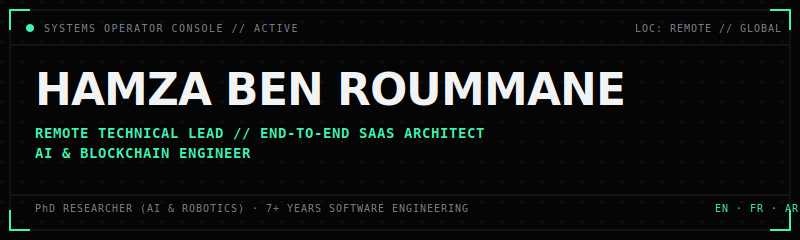
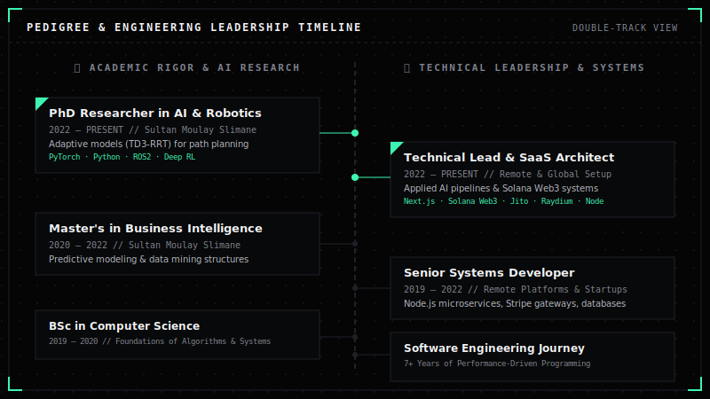

  

> [!IMPORTANT]
> **SYS.OPERATOR // DUAL-TRACK ARCHITECTURE**
> An elite software engineer operating at the intersection of PhD-level Artificial Intelligence research and high-performance Blockchain / SaaS architectures. Shipping secure, scalable platforms end-to-end.

---

### 🎓 Pedigree & Engineering Leadership

  

  
<b>🔍 SYSTEM INDEX: CLICK TO EXPAND TEXT-BASED TIMELINE & ACADEMICS (SEO ARCHIVE)</b>

   

| 🎓 Academic Rigor & AI Research | 💻 Technical Leadership & Systems |
| :--- | :--- |
| **PhD Candidate in AI & Robotics** (2022 — Present) *Sultan Moulay Slimane University* • Researching Deep Reinforcement Learning (DRL) algorithms for autonomous navigation (TD3, Soft Actor-Critic). • Developing hybrid path planning models. • *Tech: Python, PyTorch, ROS2, Gazebo, Deep RL* | **Technical Lead & AI SaaS Architect** (2022 — Present) *International & Remote Setup* • Architecting custom AI systems (fine-tuning, RAG, custom pipelines) and high-throughput Web3 engines. • Solo delivery of end-to-end SaaS platforms. • *Tech: Next.js, Solana Web3.js, Jito, Raydium, Node.js* |
| **Master's in Business Intelligence** (2020 — 2022) *Sultan Moulay Slimane University* • Designed predictive models, high-performance data pipelines, and decision support architectures. | **Senior Full-Stack & Systems Developer** (2019 — 2022) *Remote Startups & Platforms* • Designed database schemas, concurrent Node.js microservices, and custom API architectures. |
| **Bachelor's in Computer Science** (2019 — 2020) *Sultan Moulay Slimane University* • Core software engineering foundations, data structures, and algorithms. | **Software Engineering Journey** (7+ Years) *Systems & Open Source* • Building secure, modular web applications, HFT bots, and core performance architectures. |

---

### ⚡ Core Subsystems (Capabilities)

> [!TIP]
> **APPLIED AI & NEURAL SYSTEMS**
> * Custom model training and LLM fine-tuning, RAG (Retrieval-Augmented Generation) infrastructure, deep reinforcement learning (DRL) models, and adaptive pathfinding algorithms.
> * *Tech Stack: PyTorch, Python, ROS2, Gazebo, Hugging Face, Vector DBs.*

> [!TIP]
> **SOLANA WEB3 & HIGH-PERFORMANCE**
> * Smart contracts in Rust/Anchor, JS-native Solana architectures (Web3.js), Jito bundling, Raydium SDK, and high-frequency trading (HFT)/MEV volume automation.
> * *Tech Stack: Rust, Anchor, Web3.js, Jito, Raydium SDK, Solana CLI.*

> [!TIP]
> **END-TO-END SAAS ENGINEERING PIPELINE**
> * Complete product delivery: scalable databases, concurrent Node.js microservices, Next.js frontend interfaces, Stripe billing gateways, and programmatic growth engines.
> * *Tech Stack: Next.js, React, Node.js, Python, PostgreSQL, MongoDB, Docker, Stripe.*

---

### 🚀 Active Ventures (Operating Products)

<table>
  <tr>
    <td width="50%" valign="top">
      <h3>🚀 Humanixio</h3>
      
<b>AI Academic Humanizer (B2C SaaS)</b>

      
An AI writing humanization platform built on a custom fine-tuned LLM. Engineered entirely solo, from database schema and model routing to Stripe payments and programmatic growth.

      
<a href="https://humanixio.com"><b>Access Console &rarr;</b></a>

    </td>
    <td width="50%" valign="top">
      <h3>🚀 ChainPad</h3>
      
<b>Solana Launchpad &amp; DeFi Suite</b>

      
A no-code SPL token launchpad and DeFi liquidity bot automation suite. Built JS-native in TypeScript on Solana Web3.js, Jito, and Raydium to execute trades at sub-second speeds.

      
<a href="https://chainpad.io"><b>Access Console &rarr;</b></a>

    </td>
  </tr>
</table>

---

### 📊 System Diagnostics & Metrics

  
<b>SYSTEM STATS & LANGUAGE DISTRIBUTION</b>

   
  

    
    &nbsp;&nbsp;&nbsp;&nbsp;
    
  

  
<b>COMMIT STREAK DIAGNOSTIC</b>

   
  

    
  

  
<b>SYSTEM ACTIVITY GRAPH</b>

   
  

    
  

---

### 🐍 Contribution Activity

  <picture>
    <source
      media="(prefers-color-scheme: dark)"
      srcset="https://raw.githubusercontent.com/hamza97benroummane/hamza97benroummane/output/github-contribution-grid-snake-dark.svg"
    />
    <source
      media="(prefers-color-scheme: light)"
      srcset="https://raw.githubusercontent.com/hamza97benroummane/hamza97benroummane/output/github-contribution-grid-snake.svg"
    />
    
  </picture>

---

  

    <b>DIRECT COMMUNICATIONS:</b> 
    <a href="mailto:hamza.benroummane@gmail.com">hamza.benroummane@gmail.com</a> • 
    <a href="https://www.linkedin.com/in/hamza-ben-roummane">LinkedIn</a> • 
    <a href="https://hamzabnr.com">Portfolio Website</a>
  

